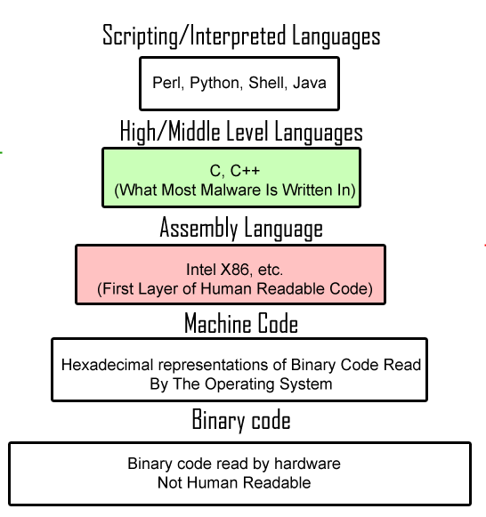

# Setup and Introduction

## How to install Python?

Python should be easy to install on basically all home computers and laptops. There are many different versions and flavors of Python. This class will be built around Python v2.7, but you will probably be fine using anything above Python v2.5.

#### Basic Python

The installation procedure depends on what operating system you have installed. [The Hitchhiker's Guide to Python](http://docs.python-guide.org/en/latest/) has a great description of how to install for the three major operating systems.

 * [Windows](http://docs.python-guide.org/en/latest/starting/install/win/)
 * [Mac OS X](http://docs.python-guide.org/en/latest/starting/install/osx/)
 * [Linux](http://docs.python-guide.org/en/latest/starting/install/linux/)

(NOTE: The above guide also explains how to install SetupTools, Pip, and VirtualEnv. While these are great tools worth learning, and I highly encourage it, they are not yet necessary for this course.)

#### Anaconda

Consider installing [Anaconda](http://docs.continuum.io/anaconda/install.html) instead. Anaconda is Python packaged with hundreds of tools and libraries that you will want. If you have any choice, I recommend installing Anaconda for this class.

## What is Python?

Python is a [high-level](https://en.wikipedia.org/wiki/High-level_programming_language), [interpretted](https://en.wikipedia.org/wiki/Interpreted_language), [dynamically-typed](https://en.wikipedia.org/wiki/Dynamic_programming_language) computer programming language whose apparent goal is to make code as easy to write as possible. The Python programming language is [free](http://www.howtogeek.com/howto/31717/what-do-the-phrases-free-speech-vs.-free-beer-really-mean/) and [open-source](https://en.wikipedia.org/wiki/Open_source#Computer_software).

### Comparing Python to other languages

To understand Python it is probably best to consider how Python differs from other programming languages. This is a good chance to explain those esoteric terms I used above.

#### High-Level

A **low-level** language is one designed directly for a computer's hardware. It is not human readable, and defines the exact calculations to be performed by the computer to the smallest detail. A **high-level** language is meant to abstract away the inner workings of a computer and make code easily readable by humans.

There are several layers of languages in the above pyramid. If you've ever worked with C or Fortran, those languages are somewhere in the middle. They are human readable, but deal with the specifics of a computer's hardware all the time (pointers, allocating and freeing memory, stack overflows). The most high-level language in the world would look just like you are reading English. And the lowest-level language in the world would be a series of incomprehsible zeros and ones.

#### Interpretted

If you've ever written Fortran or C code, you will remember having to "compile" your code. This is the process of taking your text file and turning it into an executable that can be run as a program.

Alternately, if you've ever run a Windows program, you will know about *.exe programs. You double click on them, and the program runs. But if you try to open them in a text editor, they are meaningless garbage. That's because these programs are written in terms your computer can understand, and not in anything human-readable.

But you don't have to compile Python code. The Python programming language comes with an interpreter that will read directly from your text file on the fly and execute commands as it finds them. This means you never have to compile. It also means you can type commands into the Python interpreter and they will be executed as you go:

    john@antineutrino:~$ python
    Python 2.6.6 (r266:84292, Jan 22 2014, 09:42:36) 
    [GCC 4.4.7 20120313 (Red Hat 4.4.7-4)] on linux2
    Type "help", "copyright", "credits" or "license" for more information.
    >>> def fib(n):
    >>>     a, b = 0, 1
    >>>     while a < n:
    >>>         print(a, end=' ')
    >>>         a, b = b, a+b
    >>>     print()
    >>> fib(1000)
    0 1 1 2 3 5 8 13 21 34 55 89 144 233 377 610 987

You can try out the Python interpreter online, by going to [PythonAnywhere](https://www.pythonanywhere.com/try-ipython/) or [REPL](http://repl.it/languages/Python3).

Of course, you can still write Python scripts, or "modules", as text files and execute those from the command line, a bit like they were executables or programs (but more like Shell scripts if you ever used Linux):

    john@antineutrino:~$ python my_awesome_script.py

Long story short, unlike in Fortran, you will no longer have this excuse:

#### Dynamically Typed

In most programming languages, when you define a variable `x`, you have to tell the computer what "[type](https://en.wikipedia.org/wiki/Data_type)" that variable will be: integer, decimal, letter, string, array, list of strings, table, plot, whatever. But the Python interpreter is designed to figure out what the type of the variable is on its own, from context.

If you have seen another programming language before, you may find that you have less to type in Python. Here's a comparison with some other languages you might have seen:

**In Java**:

    int three = 3;
    int six = 2 * three;

**In C**:

    int three = 3;
    int six = 2 * three;

**In Fortran**:

    integer three,six
    three = 3
    six = 2 * three

**In Python**:

    three = 3
    six = 2 * three

Python is smart enough to figure out what type your variables are, without you telling it. For instance, Python can tell what all of these variables are, just like you can:

    name = "Jesse Owens"
    height = 180
    height = 180.5
    weight = 75.5
    year = 1936
    gold_medals = ["long jump", "100m sprint", "long jump", "200m sprint", "4x100m sprint relay"]

## Why Python?

> You'll never find a programming language that frees you from the burden of clarifying your ideas.

Every programming language has syntax; rules you have to learn. But Python has a lot of traction right now with scientists and engineers. Python's rules are easier to learn than most, which lets you focus on what really matters. And after a few years of traction, there are a lot of libraries and tools written in Python just for scientists and engineers. That's what Python brings to the table: a load of handy tools designed right for you.

#### Batteries Included

That's the Python motto. The author of the first version of Python, [Guido von Rossom](http://en.wikipedia.org/wiki/Benevolent_dictator_for_life), has started a culture in the Python community that code should be easy to use. To that end, Python comes with a large collection of [standard libraries](https://en.wikipedia.org/wiki/Standard_library). Python comes with a wide range of tools to do the sorts of things that people frequently want to do with a computer programming language: complex math, random numbers, calendars, dates and times, dealing with *.zip files, communicating over the internet with HTTP, reading CSV files, you name it.

## How to make the most of this class

> The best way to learn is by doing.

Write code. If you really want to learn the material in this class, there's only one solution: use what you learn.

As a starting point, there will be example problem sets at the end of each lecture. But don't stop there!

At the beginning of the class, maybe all you can do is replace your calculator with Python. As the class continues, you should be able to replace Excel with Python. But the trick is to start using what you learn every week at work, school, or home. Practice. It's a lot harder to forget something once you've used it a dozen times.

#### Help Improve the Class

Is a lecture unclear? Did you find a grammatical mistake? Do you have an idea to help improve the class?

This class is totally open, which means it's free. It also means it's up to you to help me make this class better. To make it easier and quicker for other people to spin-up on Python and start working.

I'd love your help.

[Back to Syllabus](../../README.md)
