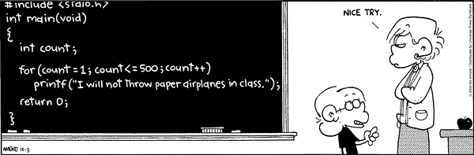

## Control Statements

### for loops

Basically, a `for` loop just does something for every value in a list. (Lists will be discussed in the next class.) For instance:

```python
new_list = [1950, 'There Will Come Soft Rains', 'Ray Bradbury', 2026]

for element in new_list:
    print(element)
```

Try that out and you will see that the above `for` loop prints every item in `new_list`. There are two important keywords here: `for` and `in`. The keyword `for` signifies the kind of loop we're going to be executing and `in` show us that we're going to be putting each item of `new_list` into the variable `element` one at a time.

Let's print the numbers 1 through 10:

```python
for number in [1, 2, 3, 4, 5, 6, 7, 8, 9, 10]:
    print(number)
```

That was easy enough, but there is a better way to write that in Python:

```python
for number in range(1, 11):
    print(number)
```

The `range` function is really helpful in Python. Much like `slice` that we saw with strings, `range` can take three inputs: `start`, `end`, and `step`. It turns out that `start` and `step` are optional:

```python
>>> range(5)
range(0, 5)
>>> type(range(5))
<class 'range'>
>>> list(range(5))
[0, 1, 2, 3, 4]
>>> list(range(1, 5))
[1, 2, 3, 4]
>>> list(range(1, 5, 2))
[1, 3]
>>> list(range(0, 30, 5))
[0, 5, 10, 15, 20, 25]
```

(**NOTE**: As you can see above, the `start` value is *inclusive* and the `end` value is *exclusive*. The default `start` is zero and the default `step` is 1.)



### while loops

A `while` loop does something until its main condition is no longer met:

```python
a = 0
while a < 10:
    a = a + 1
    print(a)
```

The above loop will print the numbers `1` through `10` and then comparison between `a` and `10` will be no longer true, and the loop will terminate. You can also create more complicated predicates for the while loop:

```python
n = 15
while n > 0 and n < 30:
    n -= 3  # this is the same as `n = n - 3`
    print(n)
```

The above loop will print the numbers 12, 9, 6, 3, 0 and then the complicated predicate will no longer be true, and the loop will terminate.

Unlike your typical `for` loop, `while` loops can fail in an interesting way. What if the predicate is *never* false?

```python
>>> n = 7
>>> while n > 0:
...     n += 1
... 
```

This is called an `infinte loop`, because it would never terminate on its own. This is, obviously, not a good thing.

(Also, notice how we have to put an extra line at the end of this for the interpretter to know the loop is done.)

### if statements


In order to write useful programs, we almost always need the ability to check conditions and change the behavior of the program accordingly. Conditional statements give us that ability. The simplest form is the `if` statement, which has the genaral form:

```python
if PREDICATE:
    BODY
```

In this case, only if the predicate is true is the body of the statement executed. For example:

```python
food = 'spam'

if food == 'spam':
    print('Ummmm, my favorite!')
    print('I feel like saying it 100 times...')
    print(100 * (food + '! '))
```

Above is the basic `if` statement. You will use these to control the logical flow of the program. But what if you want to execute a different block of code if the predicate isn't satisfied? Well, you could do this:

```python
food = 'spam'

if food == 'spam':
    print('Joy!')

if food != 'spam':
    print('Sadness...')
```

The logic desired above is so common Python provides a shortcut:

```python
if food == 'spam':
    print('Ummmm, my favorite!')
else:
    print("No, I won't have it. I want spam!")
```

There is another option. What if you want to have several different conditionals chained together? That is the purpose of the `elif` symbol:

```python
if food == 'spam':
    print('Mmmmm, my favorite!')
elif food == 'spam and eggs':
    print('Acceptable. I can pick out the eggs.')
elif food == 'spam and bacon':
    print('Acceptable. I can pick out the bacon.')
else:
    print("No, I won't have it. I want spam!")
```

The `else` symbol is optional, but it is usually good practice to include it:

```python
if food == 'spam':
    print('Mmmmm, my favorite!')
elif food == 'spam and eggs':
    print('Acceptable. I can pick out the eggs.')
```

### Continue, Break, and Pass

So far, we have seen Python's three major control statements:

    for,  while, if...elif...else

But Python also has three minor control statements:

    continue, break, pass

These are used in conjunction with the major control statements to allow for great flexibility in the logical flow of our programs.

#### The continue Statement

The `continue` statement is used inside a `for` or a `while` loop, skipping the rest of this iteration and fast forwarding to the next item in the list. Let us look at a couple examples:

```python
for letter in 'Python':
    if letter == 'h':
        continue
    print('Current Letter: ' + letter)
```

This will print:

    Current Letter : P
    Current Letter : y
    Current Letter : t
    Current Letter : o
    Current Letter : n

Here the `print` statement was hit for every letter in `Python` except the letter `h`, because of the `continue` statement. Let's try another example:

```python
var = 10
while var > 0:              
    var = var - 1
    if var % 2 == 0:
        continue
    print('Current variable value: ' + str(var))
```

This will produce following result, because the `continue` statement will skip all of the even values:

    Current variable value: 9
    Current variable value: 7
    Current variable value: 5
    Current variable value: 3
    Current variable value: 1

#### The `break` Statement

Another important way to control the flow of a program is to use `break`. When a `break` statement is reached, you immediately terminate the `for` or `while` loop:

```python
x = 0
while True:
    x += 1
    print(x)
    if x > 99:
        break
```

This will print the numbers `1` to `100` and then stop. You could, for instance, use this to figure how many integers (starting with 1) you need to add to get 10,000:

```python
sum = 0
i = 1
while True:
    sum += i
    i += 1
    if sum > 10000:
        break

print('The sum of the first ' + str(i) + ' integers is over 10,000.')
```

(Notice the extra line before the `print` statement. The interpreter needs that extra line to know the `while` loop is complete.)

#### The `pass` Statement

There is one final logical control we want to discuss. What if, when a certain set of predicates are true, we want to do nothing? That's possible. But we can't just leave the block empty, so use `pass` statement:

```python
if x == "not spam for dinner":
    print("I will destroy the universe")
elif x == "spam for dinner":
    # I'm fine with that. I'll do nothing
    pass
else:
    print("I demand spam!")
```

Without that `pass` statement the `elif` block would be empty and Python would throw an error. Try that and prove that to yourself.

### Indentation

Did you notice in the `for` and `while` loops above how the content *inside* the loop was indented? That indentation is how Python decides what logic is contained within a loop, function, or class (more on those later). Unlike in other languages you might have seen, the indentation *really* matters in Python.

`White Space` is very important in Python.

Here is an example of a correctly indented piece of Python:

```python
if n == 0:
    print 0
elif n == 1:
    print 1
else:
    print (n - 1) + (n - 2)
```

Notice how the indents line up. If we didn't align the `if`, `elif`, or `else` together, Python would throw an error:

```python
if n == 0:
    print 0
elif n == 1:
      print 1
  else:                       # ERROR: inconsistent dedent
   print (n - 1) + (n - 2)
```

Or if we didn't indent the code inside the blocks Python would throw an error:

```python
if n == 0:
    print 0
elif n == 1:
print 1                       # ERROR: no indent
else:
   print (n - 1) + (n - 2)
```


### Comments!

> You are what you comment.

If you write code and there are no comments and no documentation, the code doesn't exist. No one will want to touch it, and they won't be able to understand it if they do.

```python
# this is the first comment
spam = 1  # and this is the second comment
          # ... and now a third!
text = "# This is not a comment because it's inside quotes."

"""This is an especially long comment,
that takes up two lines."""

'''This is another especially long comment,
that takes up multiple
lines.
'''
```

## Problem Sets

 * [Basic Control Flow](problem_set_1_flow_controls.md)
 * [Modifying Strings](problem_set_2_strings.md)

## Further Reading

 * [Python Tutorial: Conditional Statements](http://www.python-course.eu/conditional_statements.php)
 * [Python Tutorial: For Loop](http://www.python-course.eu/for_loop.php)
 * [Python Tutorial: While Loop](http://www.python-course.eu/loops.php)


[Back to Syllabus](../../README.md)
