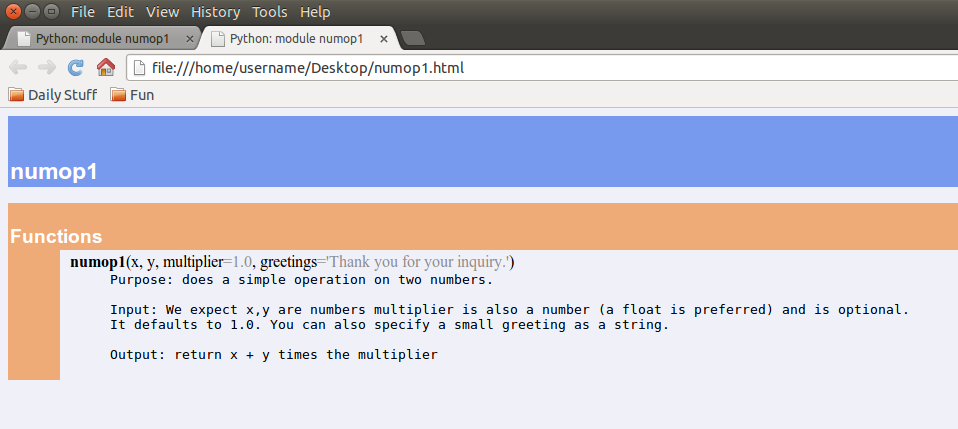

# Functions and Modules

## Functions

#### Defining a Function

A function is a handy way to encasuplate a piece of logic that needs to be performed repeatedly or made more portable.

    def say_hi():
        print('Hi!')

The structure of a function definition is:

    def FUNCTION_NAME(arg1, arg2, ..., kw1=v1, kw2=v2, ...):
        FUNCTION_BODY

The `argX` above are function arguments, and they are required (the order is important). The `kwX` above are keywords, but they are optional (the order is unimportant; the valuess are defaults).

Function names can be almost anything, but they have a few restrictions:

- contain only numbers, letters, underscores
- do not start with a number
- are not the same name as a built-in function (like `print`)

#### Example Functions

Let's look at some simple example functions. First, we'll create a trivial function to add a couple numbers:

    >>> def addnums(x, y):
        return x + y

And now let's use the function:

    >>> addnums(2, 3)
    5
    >>> addnums("a", "b")  # Wait, what?
    ab
    >>> addnums("cat", 23232)
    TypeError: cannot concatenate 'str' and 'int' objects

What we see is that the function works as expected for numbers, but since Python is a *dynamic* language, it doesn't stop you from trying to add a `string` and an `integer`. Of course, you can't add these, so a type error is thrown. This is part of the Python "we're all consenting adults" philosophy; you are trusted to know what you're doing.

Let's see that same example with key word arguments:

    >>> def addnums(x, y=2):
        return x + y
    >>> addnums(3)
    5
    >>> addnums(3, y=3)
    6
    >>> addnums("oops")
    TypeError: cannot concatenate 'str' and 'int' objects

#### Scope

The [scope](https://en.wikipedia.org/wiki/Scope_%28computer_science%29) of a variable is where the name of that variable is accessable from. Inside a function, Python keeps a local variables list. Below, `x` is not modified globally, so its scope is just inside the `times_pi` function:

    >>> def times_pi(x, y):
        x *= 3.14
        return x + y
    >>> x = 1
    >>> print(times_pi(x, 3))
    6.14
    >>> print(x)
    1

#### Documentation

**Documentation**: Just the right thing to do and Python makes it dead simple.

**Docstring**: The first unassigned string in a function (or class, method, program, etc.).

    def numop1(x,y,multiplier=1.0,greetings="Thank you for your inquiry."):
        """
            Purpose: does a simple operation on two numbers.\n
            Input: We expect x,y are numbers multiplier is also a number
            
            (a float is preferred) and is optional.
            It defaults to 1.0. You can also specify a small greeting as a string.\n
            Output: return x + y times the multiplier
        """
        if greetings is not None:
            print greetings
            return (x + y)*multiplier

## Modules

#### Imports

Try:

    import this

## main()

### How to execute Python code

#### Interpretter

#### Execute Bytecode

[Back to Syllabus](../../README.md)
