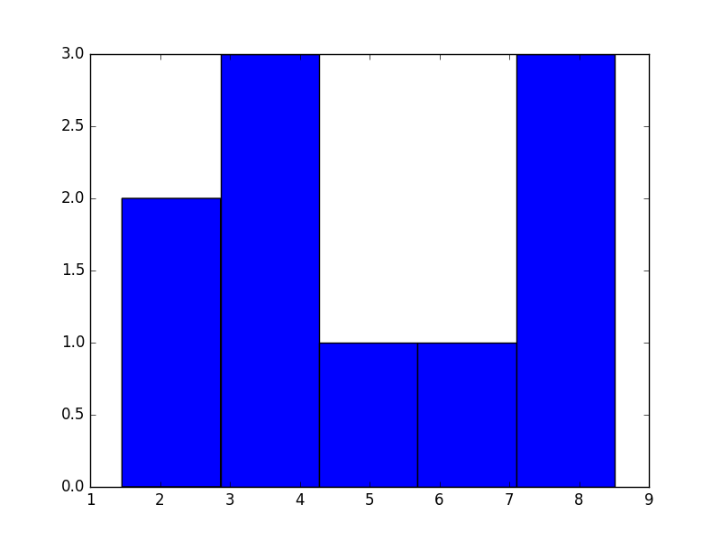
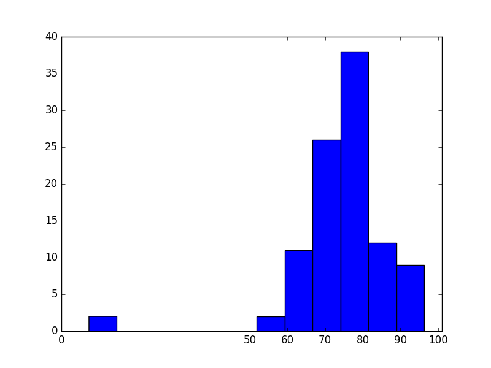
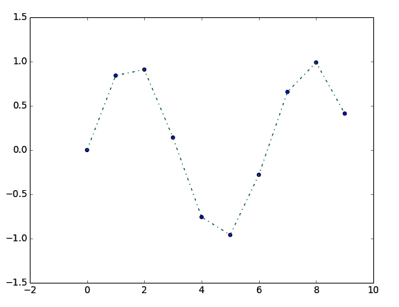
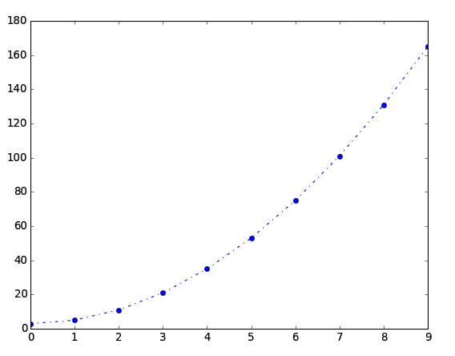

# Statistics with SciPy

SciPy is an amazingly useful library for scientists and engineers of all kinds. In this lecture, we will only cover the the sections of the module that relate to statistics and data analysis.

However, this lecture assumes a knowledge of basic statistics that would make the library useful.

## Installing SciPy

Like most of the libraries used in our "special topics" lectures, SciPy does not come standard with Python and will have to be installed. Please check the official [SciPy Stack Install Guide](http://www.scipy.org/install.html). For Linux and Mac, the installation is merely a single line of `apt-get`. For Windows, pre-built installers are provided.

#### Anaconda

Consider installing [Anaconda](http://docs.continuum.io/anaconda/install.html) instead. Anaconda is Python packaged with hundreds of libraries that you want (This includes NumPy and SciPy, as will nearly everything else we will use in this course.)

## Basics

There are as many ways to skin a cat as there are horrible people that skin cats. To that end, we will show a few different ways to do calculate most of the statistics we will show in this lecture.

To start out with, we will cover how you find the most basic information about your data.

Let us start by creating a couple of arrays of random numbers:

```python
>>> import scipy
>>> import numpy as np
>>>
>>> a_1d = np.random.uniform(low=0.0, high=10.0, size=(10,))
>>> a_1d
array([ 8.51338365,  7.04382363,  1.65352188,  2.97530282,  3.51448975,
        7.16790676,  3.27344898,  5.08118521,  7.17176604,  1.4555186 ])
>>>
>>> a_2d = np.random.uniform(low=0.0, high=10.0, size=(10, 10))
>>> a_2d
array([[ 8.86044547,  0.96993282,  2.50820612,  6.43874818,  0.38372758,
         7.5504052 ,  5.16605308,  7.09470322,  7.3208908 ,  6.40286995],
       [ 1.03869881,  3.69789616,  8.25003011,  7.09123556,  7.24557107,
         3.421289  ,  1.75147573,  4.44611637,  3.6072885 ,  1.3549589 ],
       [ 2.24196273,  7.53124841,  2.24682351,  8.1094773 ,  4.21279148,
         5.31604956,  0.29495096,  4.03260432,  0.39602501,  6.21026426],
       [ 3.86478679,  0.67428859,  5.39376417,  5.43997519,  1.8908046 ,
         2.71272474,  4.97857334,  2.44707458,  2.37087979,  7.1046976 ],
       [ 9.82027839,  8.06491482,  7.00413185,  9.97562942,  6.21787024,
         3.63986336,  3.29937155,  5.877333  ,  8.30773465,  0.44619107],
       [ 4.42067555,  4.97924259,  4.2428068 ,  7.86184298,  7.703883  ,
         8.6419594 ,  9.3671621 ,  2.10597327,  4.87948808,  5.08219803],
       [ 6.31323362,  0.8070407 ,  4.1273418 ,  3.42594116,  8.67331681,
         2.0544611 ,  9.7863428 ,  9.21156874,  7.72887749,  2.47045892],
       [ 7.17440072,  1.14765749,  6.46715747,  0.59357661,  3.07154304,
         7.87346556,  1.07334616,  0.07030953,  7.73467392,  9.10477275],
       [ 0.62143024,  9.87702138,  7.13771575,  5.34427576,  4.39352405,
         7.70144278,  3.15188499,  0.26411161,  0.46309563,  3.88264578],
       [ 9.91623583,  4.97173415,  0.33536802,  4.9834094 ,  1.89327326,
         8.55740353,  5.22012591,  5.59103939,  8.4829855 ,  9.20030633]])
```

For the purposes of this lecture, we can imagine that this array is very, very large. And working with the data could be quite slow and time-consuming.

#### min & max values

From the Python standard library:

```python
>>> min(a_1d)
1.4555186026909372
>>> max(a_1d)
8.5133836528870681
```

But that function fails on 2D arrays. Luckily, NumPy has you covered:

```python
>>> np.min(a_1d)
1.4555186026909372
>>> np.max(a_1d)
8.5133836528870681
>>>
>>> np.min(a_2d)
0.070309529399658066
>>> np.max(a_2d)
9.9756294183753127
```


#### mean

The [arithmetic mean](https://en.wikipedia.org/wiki/Arithmetic_mean) is the simple average of a collection of numbers.

First, let us write a simple python function to take the average of a 1D array:

```python
def average_1d(a):
    ''' Find the average of a 1D array or list '''
    length = len(a)
    if length == 0:
        return None

    total = 0.0
    for value in a:
        total += value

    return total / length

>>> average_1d(a_1d)
4.7850347335808161
```

Okay, that works for our 1D array, how would we have to change that function to work for a 2D array? What about a 3D array?

The problem becomes that we might need to write many functions like the one above to take the average of arrays/lists of an arbitrarily-large number of dimensions. BUT NumPy has this feature built right in:

```python
>>> np.mean(a_1d)
4.785034733580817
>>> np.mean(a_2d)
4.9490737540614615
```

As SciPy leverages the NumPy library to provide the same interface:

```python
>>> scipy.mean(a_1d)
4.785034733580817
>>> scipy.mean(a_2d)
4.9490737540614615
```

#### median

The [median](https://en.wikipedia.org/wiki/Median) of a collection of items is simply the middle item if the collection is ordered. Further, if there are an even number of items, the median is usually taken to be the average of a middle two.

We could write this very quickly in Python for 1D arrays:

```python
def median_1d(a):
    ''' Find the median value in a 1D array '''
    s = sorted(a)
    mid = length // 2  # integer division

    if len(s) % 2 == 1:
        return s[mid]
    else:
        return (s[mid] + s[mid - 1]) / 2.0

>>> median_1d(a_1d)
4.2978374820694523
```

How would we write a similar function to work on 2D arrays? Could we write a function that could handle arrays of any length?

Luckily, NumPy makes this a lot easier:

```python
>>> np.median(a_1d)
4.2978374820694523
>>> np.median(a_2d)
4.9813259983175247
```

As does SciPy:

```python
>>> scipy.median(a_1d)
4.2978374820694523
>>> scipy.median(a_2d)
4.9813259983175247
```

#### The standard deviation

If we have a large set of random data we might think think to apply the [normal distribution](https://en.wikipedia.org/wiki/Normal_distribution), and calculate the [standard deviation](https://en.wikipedia.org/wiki/Standard_deviation) from the mean:

```python
def standard_deviation_1d(a):
    ''' The Standard Deviation is the sum of squares
        of the difference of a set of number from its mean '''
    n = len(a)
    if n < 2:
        raise ValueError('variance requires at least two data points')

    mean = average_1d(a)
    sum_squares = sum((x - mean)**2 for x in a)

    return (sum_squares / n)**0.5


>>> standard_deviation_1d(a_1d)
2.4193251025103226
```

Okay, now how are you going to modify that to handle 2D data? How about 3D?

Not only will using the NumPy version be easier, it will also be *much* faster:

```python
>>> np.std(a_1d)
2.4193251025103222
>>> np.std(a_2d)
2.9163306158037896
```

Or you can use the, identical, SciPy version:

```python
>>> scipy.std(a_1d)
2.4193251025103222
>>> scipy.std(a_2d)
2.9163306158037896
```

#### Trimmed Stats

Frequently, you will have real-world data with obviously bad values. Perhaps you will have population data with negative numbers, or fractional values over 1.0. It happens a lot, and we frequently spend time cleaning out the bad data. A nice short-cut is to calculate your statistics directly, using upper and lower limits of acceptable values.

Let us try to add upper and lower limits to our our `average_1d` function above:

```python
def trimmed_average_1d(a, min=-np.inf, max=np.inf):
    ''' Find the average of a 1D array or list '''
    if len(a) == 0:
        return None

    count = 0.0
    total = 0.0
    for value in a:
        if value < min or value > max:
            continue
        total += value
        count += 1.0

    return total / count

>>> trimmed_average_1d(a_1d, 0.9)
4.7850347335808161
>>> trimmed_average_1d(a_1d, 0.9, 99)
4.7850347335808161
>>> trimmed_average_1d(a_1d, 5, 10)
6.995613059282161
```

We haven't seen `np.inf` before. Can you guess what it is? ([Here](http://docs.scipy.org/doc/numpy/reference/generated/numpy.isinf.html) is a clue, if you can't.)

Again, how would you modify this to work for 2D arrays? What if we want the limits to be exclusive?

The above function isn't very fast. Enter the Scipy `stats` module. It has a *lot* of similar variants on basic statistics:

```python
>>> from scipy import stats
>>>
>>> stats.tmean(a_1d, (2, 5))
3.2544138523761146
>>> stats.tmean(a_2d, (2, 5))
3.5770768713821144
```

The `SciPy.stats` library even allows you to set whether or not you want your limits to be inclusive or exclusive:

```python
>>> stats.tmean(a_1d, (2, a_1d[0]))
5.5926633566923929
>>> stats.tmean(a_1d, (2, a_1d[0]), (False, False))
5.1754176000931551
```

And, of course, this will also work with multi-dimensional arrays:

```python
>>> stats.tmean(a_2d, (2, a_2d[0][0]))
5.5236309063898084
>>> stats.tmean(a_2d, (2, a_2d[0][0]), (False, False))
5.4759621268813028
```

You can also find the [standard deviation](https://en.wikipedia.org/wiki/Standard_deviation) of a trimmed dataset:

```python
>>> stats.tstd(a_1d)
2.5501925747843224
>>> stats.tstd(a_1d, (2, 5))
0.27009699716883712
>>>
>>> stats.tstd(a_2d)
2.9310225506809933
>>> stats.tstd(a_2d, (2, 5))
0.96050820677662707
```


## Stats

The `scipy.stats` module has a great collection of different statistical functions and tools. For a complete listing of what is in this module, check the [documentation](http://docs.scipy.org/doc/scipy/reference/tutorial/stats.html).

#### Histograms

Whether for analysis or plotting, we frequently want to make a [histogram](https://en.wikipedia.org/wiki/Histogram) out of our data.

Use `stats.histogram` to produce a histogram, by simply providing an array of data and the number of bins:

```python
>>> plt.hist(a_1d, 5)
(array([ 2.,  3.,  1.,  1.,  3.]), array([ 1.4555186 ,  2.86709161,  4.27866462,  5.69023763,  7.10181064,
    8.51338365]), <a list of 5 Patch objects>)
```

A tuple of four items was returned:

    (values in the 5 bins you asked for, and the start points of each bins)

That is, the `histogram` return has bins from: 1.4555186 -> 2.86709161 ->  4.27866462 ->  5.69023763 ->  7.10181064 ->
        8.51338365

And inside these bins we have the values: 2, 3, 1, 1, 3.

We can also plot the histogram quite easily using matplotlib:

```python
>>> import matplotlib.pyplot as plt
>>> plt.hist(a_1d, 5)
>>> plt.show()
```



Alternatively, you can use `stats.histogram2` to calculate how many items are in each bin, if you provide both the data *and* the location of the bins:

```python
>>> stats.histogram2(a_1d, range(10))
array([0, 2, 1, 2, 0, 1, 0, 3, 1, 0])
```

If you have no prior opinion about how you want your histogram to look, use `stats.histogram`. However, if you want detailed control over your historgram, use `stats.histogram2`.

#### Percentiles

If you want to know [percentile](https://en.wikipedia.org/wiki/Percentile) of a dataset a certain value would be at, you could use `stats.percentileofscore`:

```python
>>> from numpy as np
>>> from scipy import stats
>>> 
>>> >>> grades = np.random.normal(75, 9, 100)
>>> grades
array([ 95.36245368,  86.87214208,  81.74413728,  13.64507406, ...
>>> 
>>> stats.percentileofscore(grades, 60)
5.0
>>> stats.percentileofscore(grades, 70)
22.0
>>> stats.percentileofscore(grades, 80)
78.0
>>> stats.percentileofscore(grades, 90)
95.0
```

Or you can go the opposite direction and ask what percentile a certain score would fit into with `stats.scoreatpercentile`:

```python
>>> stats.scoreatpercentile(grades, 55)
75.735603964484469
>>> stats.scoreatpercentile(grades, 64)
76.736086980756582
>>> stats.scoreatpercentile(grades, 72)
78.737830341206873
```

Finally, we can plot a histogram of the 100 grades above, and use the percentiles as the horizontal axis to see how the grade distribution in the class looks:

```python
>>> plt.hist(grades, 12)
>>> grade_breaks = np.array([0,50,60,70,80,90,100])
>>> plt.xticks((len(grades)-1) * grade_breaks/100., map(str, grade_breaks))
>>> plt.show()
```




## Interpolation

Use `stats.interp1d` if you have a 1D series of data points and you want to build a spline interpolating function:

```python
>>> from numpy import sin, pi
>>> x = [float(i) for i in range(10)]
>>> y = [sin(i) for i in range(10)]
>>> 
>>> from scipy.interpolate import interp1d
>>> 
>>> f = interp1d(x, y)
>>> f2 = interp1d(x, y, kind='cubic')
```

Here we used `interp1d` to create the Python functions `f` and `f2` that we can now use, just like any other Python function:

```python
>>> f([pi/2, pi, 2*pi])
array([ 0.88018607,  0.01398078, -0.01424018])
>>> f2([pi/2, pi, 2*pi])
array([  9.92889428e-01,   5.22304460e-04,   4.39283521e-05])
```

You might remember from trignometry, `sin(pi/2) = 1.0` and `sin(pi) = 0.0`. So what we see is that adding `kind=cubic` to our `interp1d` made the interpolated function more accurate.



There are several other `kind` options to help us build spline interpolatations:

 * linear
 * nearest
 * zero
 * slinear
 * quadratic
 * cubic

#### For the More Curious

Similar to `interp1d`, you can use `stats.grid_data` to fit a multi-dimensional data. For more on that look [here](http://docs.scipy.org/doc/scipy/reference/tutorial/interpolate.html#multivariate-data-interpolation-griddata).

Another feature of the `interpolate` module you might find interesting is the ability to take fine-tune control of a [splite fit](http://docs.scipy.org/doc/scipy/reference/tutorial/interpolate.html#spline-interpolation).

## Optimize

Frequently, your data will not be spread evenly along a simple line curve, like in the `interp1d` example above. Your data will be a huge spread of points, with possibly multiple values at the same `x`. In this case, your curve fit can't pass through every point in your data, and you will want to use `scipy.optimize.curve_fit`:

First, let's create some sample data sets along the curve `y = A x^2 + b x + c`:

```python
>>> x = range(10)
>>> >>> y = [2 * i * i + 3 for i in range(10)]
```

Now, because we're working with NumPy and SciPy, we have to convert these to the `numpy.array` type:

```python
>>> from numpy import array
>>> x = array(x)
>>> y = array(y)
```

Okay, unlike `interp1d`, when we use `curve_fit` we have to provide a generic equation to fit to, in the form of a function:

```python
>>> def quad(x, a, b, c):
...     return a * x * x + b * x + c
```

Now we can create the fit to our function:

```python
>>> from scipy.optimize import curve_fit
>>> f = curve_fit(quad, x, y)
>>> f
(array([  2.0,  -2.18691731e-12,   3.0]), inf)
```

Here f[0] is an array of the `a`, `b`, and `c` values that go into our quadratic function `quad` above. And, as we can see, the results are extremly close. The only difference is that b, instead of being `0.0`, is `-2.18691731e-12`. But, hey, if our scientific results come out accurate to one part in `1e-12`, we're probably pretty happy!



You also have the option to give your `curve_fit` and intial guess, so it has a place to start. For instance, we might know that the y-intercept is `3`, but not really know the other two coefficients, so we'll guess `1.0` for them:

```python
>>> f = curve_fit(quad, x, y, p0=[1.0, 1.0, 3.0])
>>> f
(array([  2.0,  -2.18691731e-12,   3.0]), inf)
```

So in the end, `curve_fit` is an extremely powerful tool that will let us fit an collection of data points with a function of our own creation. This takes slightly longer to use than `interp1d`, but is an extremely powerful tool.


## Problem Sets

 * [Stats with SciPy](problem_set_1_scipy.md)

## Further Reading

 * [Least Squares Fitting](http://docs.scipy.org/doc/scipy/reference/tutorial/optimize.html#least-square-fitting-leastsq)
 * [Official Tutorial](http://docs.scipy.org/doc/scipy/reference/tutorial/)
 * [Official Tutorial - Stats](http://docs.scipy.org/doc/scipy/reference/tutorial/stats.html)
 * [Official Docs - Stats](http://docs.scipy.org/doc/scipy/reference/stats.html#module-scipy.stats)
 * [Official Tutorial - Interpolation](http://docs.scipy.org/doc/scipy/reference/tutorial/interpolate.html)
 * [SciPy Statistics - Official Tutorial](http://docs.scipy.org/doc/scipy/reference/tutorial/stats.html)
 * [PDF Intro to NumPy and SciPy](http://www.engr.ucsb.edu/~shell/che210d/numpy.pdf)
 * [Sam's SciPy Intro](http://www.sam.math.ethz.ch/~raoulb/teaching/PythonTutorial/intro_scipy.html)
 * [Official Tutorial - Optimizations](http://docs.scipy.org/doc/scipy/reference/tutorial/optimize.html)

[Back to Syllabus](../../README.md)
