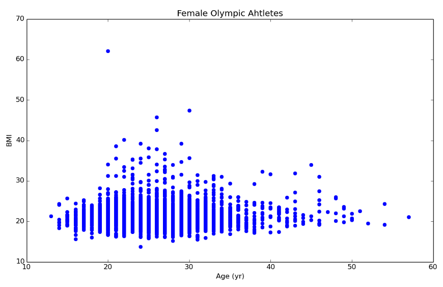

# Stats with SciPy

For this problem set, we will be using real data. We will analyze the height and weight of the athletes at the 2012 London Olympics. You can find the CSV for this dataset [here](london_2012_olympic_athlete_data.csv).

## Reading the Data

1. Use `DictReader` from `import csv` to read the CSV data file into a list of dictionaries named `athletes`, where each row is a dictionary.
2. Create a list named `ages` that is a simple list of integers of all the ages in our file.
3. Create two lists named `ages_female` and `ages_male` that is a simple list of integers of the ages of female and male athletes.
4. Create three lists `weights`, `weights_female`, and `weights_male`, much like parts 2 and 3, that are simple lists of integers values of the weights from `athletes`.
5. Create three lists `heights`, `heights_female`, and `heights_male`, much like parts 2 and 3, that are simple lists of integers values of the heights from `athletes`.
6. Create a list called `bmi`, which is a list of the body mass index (BMI) values for each athlete in our list. (**HINT**: BMI = weight {kg} / (height {meters} * height {meters}).)
7. Much like part 5, create two lists `bmi_female` and `bmi_male`, which include just the BMI values for the female and male atheletes respectively.

**NOTE**: This problem set deals with the [BMI](https://en.wikipedia.org/wiki/Body_mass_index) because it is easy to calculate for this particular data set. However, the BMI has many [limitations](https://en.wikipedia.org/wiki/Body_mass_index#Limitations), and it does not fully represent the health of the human body.

## Basic Stats

1. Find the mean and standard deviation of: `ages`, `ages_female`, and `ages_male`. What do you now know about the age of Olympic athletes? Is this what you expected?
2. Find the mean and standard deviation of: `heights`, `heights_female`, and `heights_male`. We probably expect the average man to be somewhat taller than the averge woman. Is that true for Olympic athletes?
3. Find the mean and standard deviation of: `weights`, `weights_female`, and `weights_male`. We probably expect the average man to be somewhat heavier than the averge woman. Is that true for Olympic athletes?
4. Find he mean and standard deviation of: `bmi`, `bmi_female`, and `bmi_male`. What is a typical BMI for an Olympic athlete?

## Stats

1. How do the geometric mean and harmonic mean compare for `heights_female`?
2. How do the geometric mean and harmonic mean compare for `weights_male`?
3. Build a 10-bin histogram from the `bmi` list.
4. Build a histogram for the `heights_female` and `heights_male` lists, starting at 120 cm and going to up to 220 cm in 10 cm increments.

#### Percentiles

If Angelina Jolie and Brad Pitt were in the `athletes` list above, here is what their lines would look like:

    {'Name': 'Angelina Jolie', 'Age': '40', 'Sex': 'F', 'Weight (kg)': '56.5', 'Sport': 'Acting', 'Height (cm)': '173'}
    {'Name': 'Brad Pitt', 'Age': '52', 'Sex': 'M', 'Weight (kg)': '78', 'Sport': 'Acting', 'Height (cm)': '180'}

1. What percentile is Angelina Jolie's weight, compared to the `weights_female` list?
2. What percentile is Brad Pitt's height, compared to the `heights_male` list?
3. What percentile would Angelina and Brad fall into in `bmi_female` and `bmi_male` respectively?
4. What percentile would YOU fall into, in your respective sex height, weight, and bmi? (No judgements!)

## Interpolation

Let's try and fit our data. First, we will try to interpolate between the age and the BMI of our Olympic athletes. As it happens, interpolation is meant for the situation where we have one X value for one Y value. Since we have many duplicate ages among our athletes, this is not a good fit. While taking a small sample of the data is fine for education, it is probably not what we would do with this data in real life.

1. Use `dict` and `zip` to make a dictionary of the first 25 athletes in your `ages` and `bmi` lists. Name your dictionary `bmi_by_age`.
2. Create a ordered list, named `age_keys` of the ages in `bmi_by_age`. (Use `sorted` and `.keys()`.)
3. Create a list, named `bmi_values`, of the bmi values associate with each age in `age_keys`. (Use a `for` loop and your `age_keys` along with `bmi_by_age`.)
4. Create a function `f_linear` that is an interpolation of `age_keys` and `bmi_values`. (Use `interp1d`.)
5. Create a function `f_cubic` that is a cubic interpolation of `age_keys` and `bmi_values`. (Use `interp1d` along with `kind='cubic'`.)
6. Try different ages in your `f_linear` and `f_cubic` functions. How well do they match each other? How well do they match the data? Do they make sense?

## Optimize

Let's try to analyze all of our data points (athletes) in a slightly more realistic way. A good start would be to use a more general curve-fitting approach.

Just to help you through the process, here is the data you're trying to fit:

1. Convert the following from lists to `numpy.array`: `ages_female`, `ages_male`, `bmi_female`, and `bmi_male`.
2. Create a function named `linear` that takes `x`, `a`, and `b` and returns ax + b.
3. Use `curve_fit` and your `linear` function to fit the data where female athletes ages are the x-value and female athletes BMI are the y-values. Do you think your fitted function matches the plot above?
4. Use `curve_fit` and your `linear` function to fit the data where male athletes ages are the x-value and male athletes BMI are the y-values. Do you think your fitted function seems reasonable? How could you test that?

## Solutions

* [Stats - Solutions](problem_set_1_solutions.md)

[Back to Lecture](lecture_11.md)
