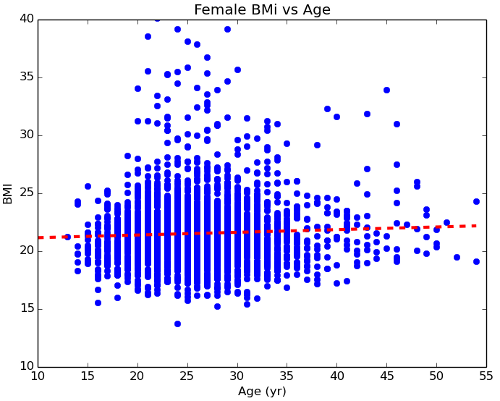
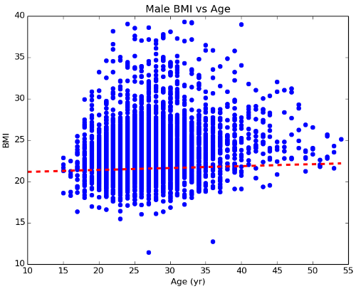

# Stats with SciPy

## Reading the Data

#### 1. Use `DictReader` from `import csv` to read the CSV data file into a list of dictionaries, where each row is a dictionary.

    >>> import csv
    >>> f = open('london_2012_olympic_athlete_data.csv', 'r')
    >>> dict_reader = csv.DictReader(f)
    >>> athletes = []
    >>> for row in dict_reader:
    ...     athletes.append(row)

#### 2. Create a list named `ages` that is a simple list of integers of all the ages in our file.

    >>> ages = []
    >>> for athlete in athletes:
    ...     ages.append(int(athlete['Age']))

#### 3. Create two lists named `ages_female` and `ages_male` that is a simple list of integers of the ages of female and male athletes.

    >>> ages_female = []
    >>> ages_male = []
    >>> 
    >>> for athlete in athletes:
    ...     if athlete['Sex'] == 'F':
    ...         ages_female.append(int(athlete['Age']))
    ...     else:
    ...         ages_male.append(int(athlete['Age']))

#### 4. Create three lists `weights`, `weights_female`, and `weights_male`, much like parts 2 and 3, that are simple lists of integers values of the weights from `athletes`.

    >>> weights = []
    >>> weights_female = []
    >>> weights_male = []
    >>> 
    >>> for athlete in athletes:
    >>>     weights.append(int(athlete['Weight (kg)']))
    >>>     if athlete['Sex'] == 'F':
    >>>         weights_female.append(int(athlete['Weight (kg)']))
    >>>     else:
    >>>         weights_male.append(int(athlete['Weight (kg)']))

#### 5. Create three lists `heights`, `heights_female`, and `heights_male`, much like parts 2 and 3, that are simple lists of integers values of the heights from `athletes`.

    >>> heights = []
    >>> heights_female = []
    >>> heights_male = []
    >>> 
    >>> for athlete in athletes:
    >>>     heights.append(int(athlete['Height (cm)']))
    >>>     if athlete['Sex'] == 'F':
    >>>         heights_female.append(int(athlete['Height (cm)']))
    >>>     else:
    >>>         heights_male.append(int(athlete['Height (cm)']))

#### 6. Create a list called `bmi`, which is a list of the body mass index (BMI) values for each athlete in our list. (**HINT**: BMI = weight {kg} / (height {meters} * height {meters}).)

    >>> bmi = []
    >>> 
    >>> for athlete in athletes:
    >>>     num = int(athlete['Weight (kg)'])
    >>>     denom = int(athlete['Height (cm)']) / 100.0
    >>>     bmi.append(num / (denom * denom))

#### 7. Much like part 5, create two lists `bmi_female` and `bmi_male`, which include just the BMI values for the female and male atheletes respectively.

    >>> bmi_female = []
    >>> bmi_male = []
    >>> 
    >>> for athlete in athletes:
    ...     bmi_val = float(athlete['Weight (kg)']) / ((float(athlete['Height (cm)']) / 100.0) ** 2)
    ...     if athlete['Sex'] == 'F':
    ...         bmi_female.append(bmi_val)
    ...     else:
    ...         bmi_male.append(bmi_val)

## Basic Stats

#### 1. Find the mean and standard deviation of: `ages`, `ages_female`, and `ages_male`. What do you now know about the age of Olympic athletes? Is this what you expected?

    >>> scipy.mean(ages)
    26.6275497031
    >>> scipy.std(ages)
    5.5641516181

    >>> scipy.mean(ages_female)
    25.9508290452
    >>> scipy.std(ages_female)
    5.37479087566

    >>> scipy.mean(ages_male)
    27.1847928437
    >>> scipy.std(ages_male)
    5.65489675013

Okay so Olympic athletes are 26.6 +/- 5.6 years. So... Olypmic athletes are in their 20s, mostly. That seems right. Female and male athletes have about the same age distribution. That also seems about right, intuitively.

#### 2. Find the mean and standard deviation of: `heights`, `heights_female`, and `heights_male`. We probably expect the average man to be somewhat taller than the averge woman. Is that true for Olympic athletes?

    >>> scipy.mean(heights)
    178.139297702
    >>> scipy.std(heights)
    11.2368389768

    >>> scipy.mean(heights_female)
    171.334190966
    >>> scipy.std(heights_female)
    8.74347474997

    >>> scipy.mean(heights_male)
    183.742937853
    >>> scipy.std(heights_male)
    9.88711339731

Men are, on average, somewhat taller than women. Sure, that seems reasonable.

#### 3. Find the mean and standard deviation of: `weights`, `weights_female`, and `weights_male`. We probably expect the average man to be somewhat heavier than the averge woman. Is that true for Olympic athletes?

    >>> scipy.mean(weights)
    73.2650400207
    >>> scipy.std(weights)
    16.2864434653

    >>> scipy.mean(weights_female)
    63.4554030875
    >>> scipy.std(weights_female)
    10.9700661228

    >>> scipy.mean(weights_male)
    81.3427495292
    >>> scipy.std(weights_male)
    15.4945692197

What isn't surprising at all here is that men tend to weight more than women. It is interesting just how wide the standard deviations are here. There is a really big range of weights among Olympic athletes. Is this, perhaps, due to the different body types needed for different sports?

#### 4. Find he mean and standard deviation of: `bmi`, `bmi_female`, and `bmi_male`. What is a typical BMI for an Olympic athlete?

    >>> scipy.mean(bmi)
    22.8615208899
    >>> scipy.std(bmi)
    3.29673647767

    >>> scipy.mean(bmi_female)
    21.5335466351
    >>> scipy.std(bmi_female)
    2.77663273887

    >>> scipy.mean(bmi_male)
    23.9550364133
    >>> scipy.std(bmi_male)
    3.28962341446

Okay, so Olympic athletes have BMI values that tend to range from 19 to 26 (within one standard deviation of the mean). That is actually really intesting. So, accounting for body types and sporting differences, this seems to be a wide range of values for the healthiest 20-somethings of our species.

## Stats

#### 1. How do the geometric mean and harmonic mean compare for `heights_female`?

    >>> import scipy
    >>> from scipy import stats
    >>>
    >>> scipy.mean(heights_female)
    171.334190966
    >>> stats.gmean(heights_female)
    171.111899541
    >>> stats.hmean(heights_female)
    170.890202922

Okay, they are very close. But the Harmonic Mean is notably lower.

#### 2. How do the geometric mean and harmonic mean compare for `weights_male`?

    >>> import scipy
    >>> from scipy import stats
    >>>
    >>> scipy.mean(weights_male)
    81.3427495292
    >>> stats.gmean(weights_male)
    79.961280503
    >>> stats.hmean(weights_male)
    78.6466219327

Again, they are all pretty close, but on this scattered dataset, the Harmonic Mean is the lowest.

#### 3. Build a 10-bin histogram from the `bmi` list.

    >>> from scipy import stats
    >>> stats.histogram(bmi, 10)
    (array([  3.00000000e+00,   1.31100000e+03,   5.48500000e+03,
             7.88000000e+02,   1.27000000e+02,   2.50000000e+01,
             3.00000000e+00,   1.00000000e+00,   1.00000000e+00,
             2.00000000e+00]), 8.552998285872599, 5.804540028960087, 0)

So, to re-write those numbers to be easier to read, the count in each bin is:

    [3, 1311, 5485, 788, 127, 25, 3, 1, 1, 2]

The first bin starts at 8.55, and each bin is 5.8 wide. There are no data points left outside the historgram.

#### 4. Build a histogram for the `heights_female` and `heights_male` lists, starting at 1 meter and going to up to 2.6 meters in 0.2 meter increments.

    >>> from scipy import stats
    >>>
    >>> bins = range(120, 221, 10)
    >>> print bins
    [120, 130, 140, 150, 160, 170, 180, 190, 200, 210, 220]
    >>> print stats.histogram2(heights_female, bins)
    [   0    2    7  256 1218 1369  552   89    5    0    0]
    >>> print stats.histogram2(heights_male, bins)
    [   0    0    0   18  265 1106 1629  987  214   28    1]

#### Percentiles

If Angelina Jolie and Brad Pitt were in the `athletes` list above, here is what their lines would look like:

    {'Name': 'Angelina Jolie', 'Age': '40', 'Sex': 'F', 'Weight (kg)': '56.5', 'Sport': 'Acting', 'Height (cm)': '173'}
    {'Name': 'Brad Pitt', 'Age': '52', 'Sex': 'M', 'Weight (kg)': '78', 'Sport': 'Acting', 'Height (cm)': '180'}

#### 1. What percentile is Angelina Jolie's weight, compared to the `weights_female` list?

    >>> from scipy import stats
    >>>
    >>> stats.percentileofscore(weights_female, 56.5)
    >>> 25.4716981132

#### 2. What percentile is Brad Pitt's height, compared to the `heights_male` list?

    >>> stats.percentileofscore(heights_male, 180)
    >>> 35.8168549906

#### 3. What percentile would Angelina and Brad fall into in `bmi_female` and `bmi_male` respectively?

    >>> stats.percentileofscore(bmi_female, 56.5 / (1.73 * 1.73))
    >>> 10.5488850772
    >>>
    >>> stats.percentileofscore(bmi_male, 78.0 / (1.8 * 1.8))
    >>> 57.827212806

#### 4. What percentile would YOU fall into, in your respective sex height, weight, and bmi? (No judgements!)

This question is just for you. It is interesting, but unless you want to compete in a sport at the Olympic level, please don't take it too seriously.

## Interpolation

#### 1. Use `dict` and `zip` to make a dictionary of the first 25 athletes in your `ages` and `bmi` lists. Name your dictionary `bmi_by_age`.

    >>> bmi_by_age = dict(zip(ages[:25], bmi[:25]))

#### 2. Create a ordered list, named `age_keys` of the ages in `bmi_by_age`. (Use `sorted` and `.keys()`.)

    >>>> age_keys = sorted(bmi_by_age.keys())

#### 3. Create a list, named `bmi_values`, of the bmi values associate with each age in `age_keys`. (Use a `for` loop and your `age_keys` along with `bmi_by_age`.)

    >>> bmi_values = []
    >>> for age in age_keys:
    ...     bmi_values.append(bmi_by_age[age])

#### 4. Create a function `f_linear` that is an interpolation of `age_keys` and `bmi_values`. (Use `interp1d`.)

    >>> from scipy.interpolate import interp1d
    >>> f_linear = interp1d(age_keys, bmi_values)

#### 5. Create a function `f_cubic` that is a cubic interpolation of `age_keys` and `bmi_values`. (Use `interp1d` along with `kind='cubic'`.)

    >>> f_cubic = interp1d(age_keys, bmi_values, kind='cubic')

#### 6. Try different ages in your `f_linear` and `f_cubic` functions.

    >>> f_linear([20, 22, 24, 26, 28])
    array([ 23.78121284,  22.40587695,  19.96035302,  20.84398292,  24.44180209])
    >>> f_cubic([20, 22, 24, 26, 28])
    array([ 23.78121284,  22.40587695,  19.29999598,  20.99535975,  24.44180209])

They actually turn out to be nearly identical fits to the data. In this case, using a cubic fit didn't really win us much. Then again, we were only using 25 data points, so we probably didn't expect much from these fits. The values they give seem a little random, you imagine if we fit more data points we would get better results.

## Optimize

#### 1. Convert the following from lists to `numpy.array`: `ages_female`, `ages_male`, `bmi_female`, and `bmi_male`.

    >>> import numpy as np
    >>> ages_female = np.array(ages_female)
    >>> ages_male = np.array(ages_male)
    >>> bmi_female = np.array(bmi_female)
    >>> bmi_male = np.array(bmi_male)

#### 2. Create a function named `linear` that takes `x`, `a`, and `b` and returns ax + b.

    >>> def linear(x, a, b):
    ...     return x * a + b

#### 3. Use `curve_fit` and your `linear` function to fit the data where female athletes ages are the x-value and female athletes BMI are the y-values.

    >>> from scipy.optimize import curve_fit
    >>> f_female = curve_fit(linear, age_female, bmi_female)

#### 4. Use `curve_fit` and your `linear` function to fit the data where male athletes ages are the x-value and male athletes BMI are the y-values.

    >>> from scipy.optimize import curve_fit
    >>> f_male = curve_fit(linear, age_male, bmi_male)

[Back to Problem Set](problem_set_1_scipy.md)
