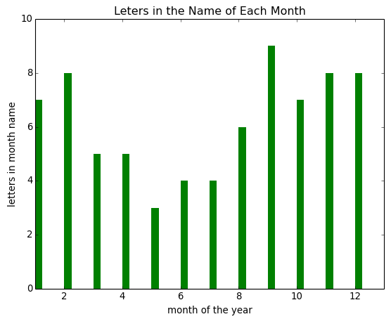
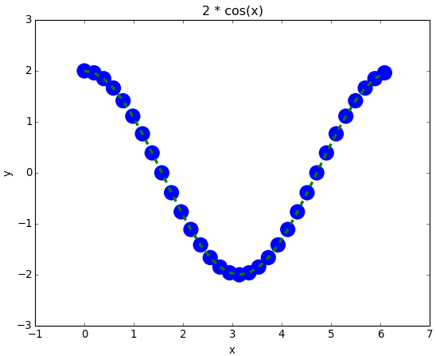
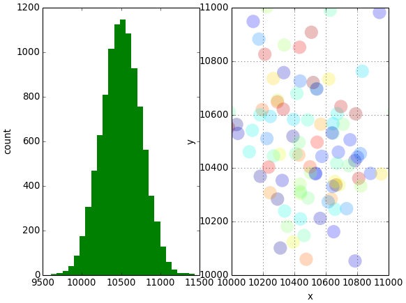

# Matplotlib - Solutions

## Bar Chart

    from numpy import arange, array
    x = arange(1, 13)
    y = array([7, 8, 5, 5, 3, 4, 4, 6, 9, 7, 8, 8])

    from matplotlib import pyplot as plt
    plt.bar(x, y, width=0.25, color='green', edgecolor='none')
    plt.xlim(1, 13)
    plt.ylim(0, 10)
    plt.xlabel('month of the year')
    plt.ylabel('letters in month name')
    plt.title('Leters in the Name of Each Month')
    plt.show()

## Scatter and Line Plots

    from numpy import arange, cos, pi
    x = arange(0.0, 2 * pi, pi / 16.0)
    y = 2 * cos(x)
    
    from matplotlib import pyplot as plt
    plt.plot(x, y, linewidth=3, c='green', linestyle='--', label='approx')
    plt.scatter(x, y, s=300, c='blue', edgecolor='none', label='approx')
    plt.xlabel('x')
    plt.ylabel('y')
    plt.title('2 * cos(x)')
    plt.savefig('cos.png')

## Multiplot, Histogram, and Errorbar

    from numpy import random
    mu = 10500
    sigma = 250
    values = mu + sigma * random.randn(10000)
    x = mu + sigma * random.randn(100)
    y = mu + sigma * random.randn(100)
    
    from matplotlib import pyplot as plt
    plt.subplot(1, 2, 1)
    plt.hist(values, 25, facecolor='green', edgecolor='none')
    plt.ylabel('count')
    plt.subplot(1, 2, 2)
    plt.scatter(x, y, s=300, alpha=0.25, edgecolor='none', c=random.rand(100))
    plt.xlabel('x')
    plt.ylabel('y')
    plt.xlim(10000, 11000)
    plt.ylim(10000, 11000)
    plt.grid()
    plt.show()

[Back to Problem Set](problem_set_1_matplotlib.md)
