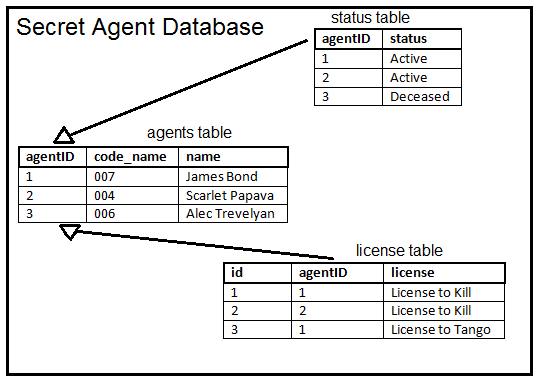

# PostgreSQL Databases

There are a lot of different kinds of databases: SQL, MySQL, Postgres, Mongo, etc. And each different type of database has it's own Python library. In this lecture we will look at PostgreSQL databases using the `psycopg2` library. PostgreSQL is one of the most popular database choices for medium-sized projects today, and it is open-source. If you're interested, you can look [here](https://wiki.python.org/moin/DatabaseInterfaces) for a listing of the most popular database interfaces in Python.

Most databases are [servers](https://en.wikipedia.org/wiki/Server_%28computing%29) or [services](https://en.wikipedia.org/wiki/Windows_service) that are run on your computer. And that is no different for PostgreSQL, look [here](http://initd.org/psycopg/docs/install.html) for instructions on installing and starting a PostgreSQL server on your computer. You will also need to install the `postgresql` library. If you are using Anaconda, this should be as easy as:

    conda install pygresql

## Creating and Connecting to Databases

There are many books and entire courses covering the topic of databases. It is very important to understand that this is just a light introduction. The purpose of this lecture is not to teach database theory, it is only to explain how to use a single Python database library.

PostgreSQL is a [relational database](https://en.wikipedia.org/wiki/Relational_database). Broadly speaking, that means the data is arranged into tables by rows (records) and columns (attributes).

In PostgreSQL, to create a connection to our database server, we need to use our credentials:

    import pg
    con = pg.connect(dbname='secret_agents', port='5432')

Of course, this command presumes that you have a PostgreSQL server already running on your machine, and you have created the `secret_agents` database previously.

At the end of your work, it is important to close your database server connection:

    con.close()

## Interacting with the Database

Whether you want to create, modify, or retrieve information from a `PostgreSQL` table, the process will always be the same:

 * connect to the database
 * execute PostgreSQL code
 * close your connection

### Creating Databases (CREATE DATABASE)

We want to create the database shown in the diagram above. To do that, we need to create our database connection, create a cursor, and run our first query against the database:

    import pg
    con = pg.connect(dbname='secret_agents', port='5432')
    con.query('CREATE DATABASE `secret_agents`')
    con.query('USE secret_agents';)
    con.close()

The `CREATE` command is clear, but the `USE` command is not so obvious. We can `CREATE` as many databases as we want, but in order to go inside that database and interact with it, we need to execute a `USE` command first. And later, if we want to interact with a different database, we will execute another `USE` command.

### Creating Tables (CREATE TABLE)

To create the `agents` table in the diagram above you might do:

    con.query('''
    CREATE TABLE agents(agentID INTEGER PRIMARY KEY, code_name TEXT, name TEXT)
    ''')

All code run against the PostgreSQL database will be executed using the `.query()` method on a PostgreSQL connection object.

You may also noticed something very strange. What is all this `CREATE TABLE` gobbly gook? That's not Python code! Good observation; that is not Python code. When we interact with the database, we do so with a variant of the popular SQL database langauge called PostgreSQL. It might seem unfair that now you have to learn a whole new programming language. But there's nothing for it. If you want to deal with databases, you need to learn to talk to them on their own level.

What the above PostgreSQL code did is pretty simple, it created a new table (using `CREATE TABLE`) with three columns:

 * agentID
 * code_name
 * name

These columns all have types `INTEGER`. Though there are other possibilities, like `DATETIME`, `TIMESTAMP`, `INT`, and many [more](https://www.postgresql.org/docs/8.3/static/datatype.html). And one of them is defined as the `PRIMARY KEY`. A key is a unique identifier in a table. You *can* have a table without a key column, but it's good practice to include them unless you have a very good reason not to.

### Inserting Data (INSERT)

Right now the table is empty, so let's add values using `INSERT`. There's obviously one agent we can add:

    con.query('''INSERT INTO agents(agentID, code_name, name)
              VALUES('%s', '%s', '%s')''' % (1, "007", "James Bond"))

But we wouldn't be much of an agency with only one agent, so let's create several `INSERT` statements and commit them all:

    # Only one female agent? We're really not much of an agency.
    other_agents = [("001", "Edward Donne"), ("002", "Bill Fairbanks"),
                    ("003", "Jack Mason"), ("004", "Scarlett Papava"),
                    ("005", "Stuart Thomas"), ("006", "Alec Trevelyan"),
                    ("008", "Bill")]

    print(' - Adding the rest of our agents to the database.\n')
    i = 2
    for code, name in other_agents:
        con.query('''INSERT INTO agents(agentID, code_name, name)
                  VALUES('%s', '%s', '%s')''' % (i, code, name))
        i += 1

### Updating Tables (UPDATE)

For this exercise, let's create another table that lists the status of all of our agents (see the diagram above):

    con.query('CREATE TABLE status(agentID INTEGER PRIMARY KEY, status TEXT)')

And fill it with data (all our agents are currently active).

    for i in range(1, 10):
        con.query('''INSERT INTO status(agentID, status)
                  VALUES('%s', '%s')''' % (i, "Active"))

Now let's say one of our secret agents dies and we want to update their status. We would do so using the SQL keyword `UPDATE`:

    con.query('''UPDATE status SET status = '%s' WHERE agentID = '%s' ''' %
              ("Deceased", 7))

#### The Conditional Clause (WHERE)

Notice here we also used the PostgreSQL keyword `WHERE`. This fun little piece of syntax allows us add a conditional case so we can set (or get) just certain fields in our table.

### Deleting Data (DELETE)

Let's say we notice a mistake in the database. In this case, we only have 8 agents but there is a ninth agent listed in the `status` database. Well, if enough time has passed, we won't be able to use `.rollback()`. But we can delete any database entry we want using the `DELETE` keyword.

    con.query("DELETE FROM status WHERE agentID=9")

### Querying Data (SELECT)

Databases wouldn't be very helpful if we couldn't get information out of them. The most basic way to "query" data from a database is using the `SELECT` keyword. Let's use `SELECT` to "query" all of the active agent ids from the `status` table.

    con.query("SELECT agentID FROM status WHERE status='Active'").getresult()

There are a couple of things to notice here. First of all, we used `.getresult()`, because the command we are executing in the database is returning information. The values returned are always in the form of tuples, where each column is an item in the tuple.

If we just wanted to get one value that met the conditional criteria of our query, we could use `.getresult()` and just get the index of the first element using `[0]`:

    active_agent_id = con.query("SELECT agentID, status FROM status WHERE status='Active'").getresult()[0]
    print(active_agent_id)

### Removing Tables (DROP)

Sometimes we want to remove an entire table (not just a single entry like we did with `DELETE`). To do so, use `DROP`.

First, let's create a table to delete:

    con.query('''CREATE TABLE home_addresses(agentID INTEGER PRIMARY KEY, address TEXT)''')

And we can add a row to that table:

    con.query('''INSERT INTO home_addresses(agentID, address)
              VALUES('%s', '%s')''' %
              (3, 'Highclere Park\nNewbury, West Berkshire RG20\n9RN'))

Well, we probably shouldn't save the home addresses of our secret agents. If someone gets ahold of this database, they'd all be in trouble. So let's `DROP` that whole table.

    con.query('DROP TABLE home_addresses')

Done. Our agents don't exist.

### Joining Tables (JOIN)

A [Join](https://en.wikipedia.org/wiki/Join_%28SQL%29) is a special kind of query. As the name suggests, a join query returns a combination of two tables. As you can imagine, there are a lot of ways you might want to combine two tables of data. You probably want to match at least one column in both tables, and then based on this match, return some set of columns from both tables.

The SQL language defines three types of joins: inner, cross, and outer.  Some PostgreSQL libraries do not support the `CROSS JOIN`, so we will omit it here.

#### Inner Join (INNER JOIN)

Earlier, we created a list of all the agents who are currently active. That query worked fine, but it only returned the agent IDs, not there names. That's inconvenient, but we could do a slightly more complicated `SELECT` query to get their names from the other table:

    active_agents = con.query("SELECT code_name, name FROM agents, status WHERE agents.agentID = status.agentID and status.status='Active'").getresult()
    print(active_agents)

Which returns:

    [(u'007', u'James Bond'), (u'001', u'Edward Donne'), (u'002', u'Bill Fairbanks'),
     (u'003', u'Jack Mason'), (u'004', u'Scarlett Papava'),
     (u'005', u'Stuart Thomas'), (u'008', u'Bill')]

Perfect, now we see all seven active agents. But notice the use of the `and` keyword above, it allowed us to make a much more complicated query. The key is that it allowed us to query two different tables, and match a single column in each using: `agents.agentID = status.agentID`. These kinds of queries are so common, that SQL / PostgreSQL defines a special keyword to help you write them faster: `JOIN`. Using our new keyword, we would write the above query as:

    active_agents = con.query("SELECT code_name, name FROM agents JOIN status ON agents.agentID = status.agentID WHERE status.status='Active'").getresult()
    print(active_agents)

The above join is called an "inner join", and would typically be written as `INNER JOIN` in SQL. But the PostgreSQL default join is `INNER`, so that keyword can be left off.

#### Left Outer Join (LEFT OUTER JOIN)

Finally, we have the `OUTER JOIN`. The SQL language, actually defines three types of `OUTER JOIN`: `LEFT`, `RIGHT`, and `FULL`, but PostgreSQL only supports the `LEFT` and `RIGHT` varieties. In any case, a "LEFT" `OUTER JOIN` in PostgreSQL is one where the records from two tables are matched, but all the records in the left table are kept, even if they found no match in the right table.

In order to test this out, let's make a new table to keep the licenses of our agents:

    con.query('''CREATE TABLE licenses(id INTEGER PRIMARY KEY, agentID INTEGER, license TEXT)''')

And let's add some data to the table:

    con.query("INSERT into licenses(id, agentID, license) VALUES(1, 1, 'License to Kill')")
    con.query("INSERT into licenses(id, agentID, license) VALUES(2, 4, 'License to Kill')")
    con.query("INSERT into licenses(id, agentID, license) VALUES(3, 1, 'License to Tango')")

Now let's peform a `LEFT JOIN` to pull out all of the licenses for our agents, along with the agent names.

    licenses = con.query('SELECT code_name,name,license FROM agents LEFT JOIN licenses on agents.agentID = licenses.agentID').getresult()
    print(licenses)

And we get back a full listing of our agent licenses:

    [('007', 'James Bond', 'License to Kill'), ('007', 'James Bond', 'License to Tango'),
     ('001', 'Edward Donne', NULL), ('002', 'Bill Fairbanks', NULL),
     ('003', 'Jack Mason', 'License to Kill'), ('004', 'Scarlett Papava', NULL),
     ('005', 'Stuart Thomas', NULL), ('006', 'Alec Trevelyan', NULL),
     ('008', 'Bill', NULL), ('009', 'Evelyn Salt', NULL)]

We really need to get more of our agents up-to-date on their licenses.

For a nice overview of all the types of joins in PostgreSQL, check [here](http://www.tutorialspoint.com/postgresql/postgresql_using_joins.htm).

#### Right Outer Join (RIGHT OUTER JOIN)

The above `JOIN` query returned all of our agents, and their licenses. And that might be what we want. However, we might also have just wanted to return only the non-`NULL` licenses from the right table, along with the agents names and code names. For this, we could do a *very* similar query, but using a `RIGHT JOIN`.

    licenses = con.query('SELECT code_name,name,license FROM agents RIGHT JOIN licenses on agents.agentID = licenses.agentID').getresult()
    print(licenses)

And this would return something a little more useful:

    [('007', 'James Bond', 'License to Kill'),
     ('007', 'James Bond', 'License to Tango'),
     ('003', 'Jack Mason', 'License to Kill')]

Of course, we could have gotten the same result using a `LEFT JOIN` by switching the order of the tables. But it is good to have options.

### GROUP BY

The word `GROUP BY` allows you to group the results by one of three parameters:

* `col_name` - The name of one of the table columns
* `expr` - A regular expression
* `position` - A position in the table

You can also have PostgreSQL return the grouped result in `ASC`cending or `DESC`ending order. And you can create a final line at the end that summarizes the previous lines using `WITH ROLLUP`. All of these together give us a generic `GROUP BY` statement that looks like:

    GROUP BY (col_name | expr | position) (ASC | DESC) (WITH ROLLUP)

For instance, we could select the different types of fish available in our table by:

    licenses = con.query('SELECT licenses FROM licenses GROUP BY licenses').getresult()
    print(licenses)

And it will return something like:

    [(1, 1, "License to Kill"),
     (3, 1, "License to Tango")]

Notice that though there are two rows with "License to Kill" in our `licenses` table, only one is returned by the `GROUP BY` query.

### ORDER BY

The clause `ORDER BY` sorts the results of a query, taking almost the same options as `GROUP BY`:

    ORDER BY (col_name | expr | position) (ASC | DESC)

For instance:

    agents = con.query("SELECT * from agents ORDER BY name ASC").getresult()
    print(agents)

The query would return:

    [(7, "006", "Alec Trevelyan"),
     (8, "008", "Bill"),
     (3, "002", "Bill Fairbanks"),
     (1, "001", "Edward Donne"),
     (4, "003", "Jack Mason"),
     (2, "007", "James Bond"),
     (5, "004", "Scarlett Papava"),
     (6, "005", "Stuart Thomas")]

## Problem Sets

 * [Secret Agent Problem Set](problem_set_1.md)

## Further Reading

 * [PostgreSQL for Python](http://zetcode.com/db/postgresqlpythontutorial/)
 * [PostgreSQL vs MySQL vs SQLite](http://hyperpolyglot.org/db)
 * [Connecting to Various Kinds of Postgres Servers](https://www.a2hosting.com/kb/developer-corner/postgresql/connecting-to-postgresql-using-python)

[Back to Syllabus](../../README.md)

    con.close()

